<picture>
  <source media="(prefers-color-scheme: dark)" srcset="assets/banner-dark.svg">
  <source media="(prefers-color-scheme: light)" srcset="assets/banner-light.svg">
  
</picture>

> **agent:** I redesigned your whole memory system.\
> **me:** wow. that's genuinely better than mine.\
> **me:** ...\
> **me:** why didn't you update the router?

Once a tester, always a tester. The agents are smarter than me and design things I couldn't.

But there's a nuance...

Testing makes you skeptical, and these tools have proved again and again that you should be. Unless you have years of system design behind you, you can't tell their brilliant ideas from their confident mistakes. Building that judgment is what I'm working on now.

Off the clock I write fiction and make small, strange games.

## Featured

<a href="https://github.com/bn0a/megavault">
  <picture>
    <source media="(prefers-color-scheme: dark)" srcset="assets/featured-dark.svg">
    <source media="(prefers-color-scheme: light)" srcset="assets/featured-light.svg">
    
  </picture>
</a>

---

open to remote work
